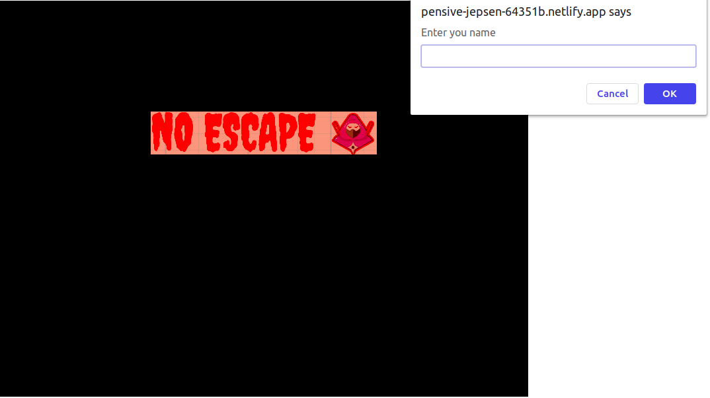
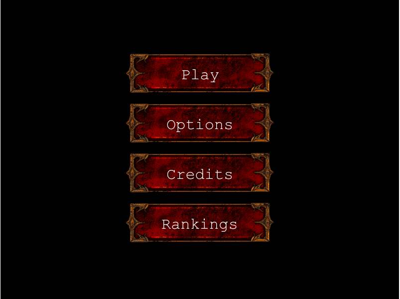
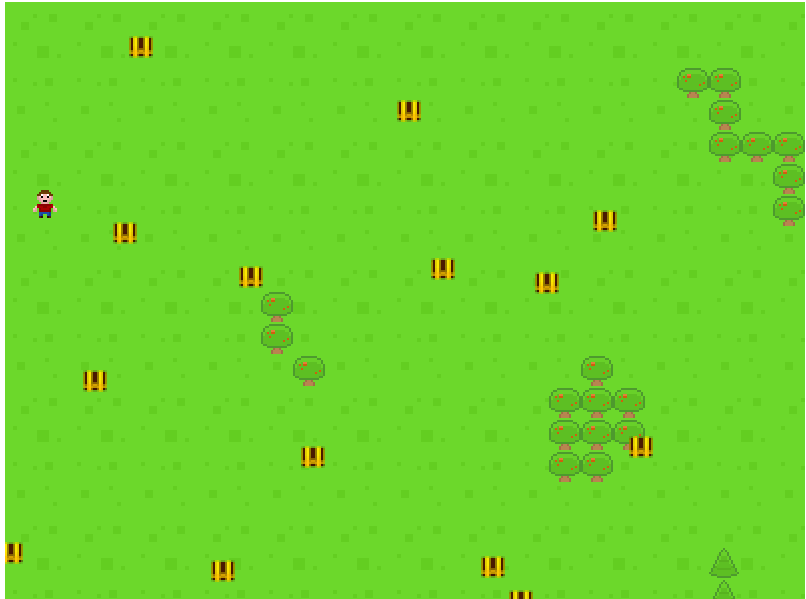
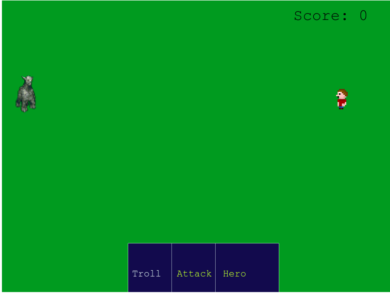
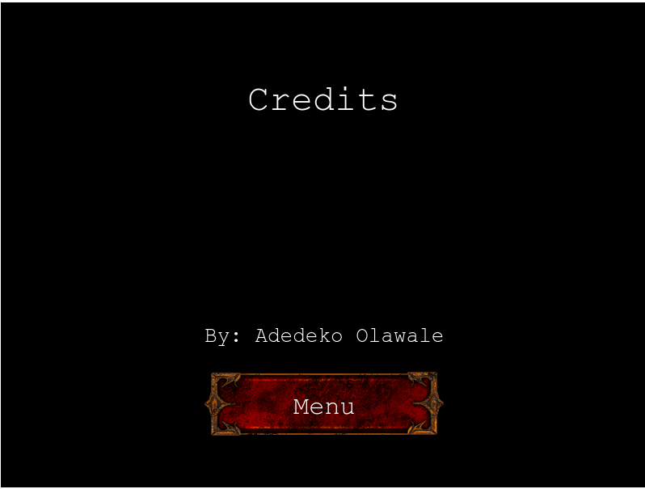
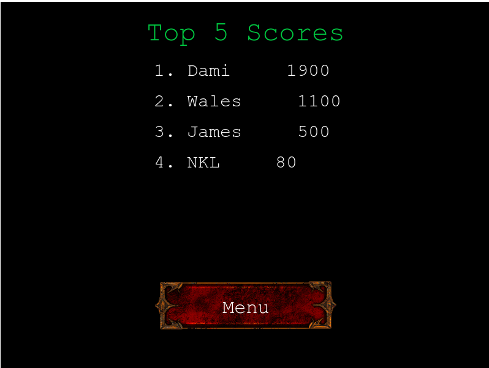
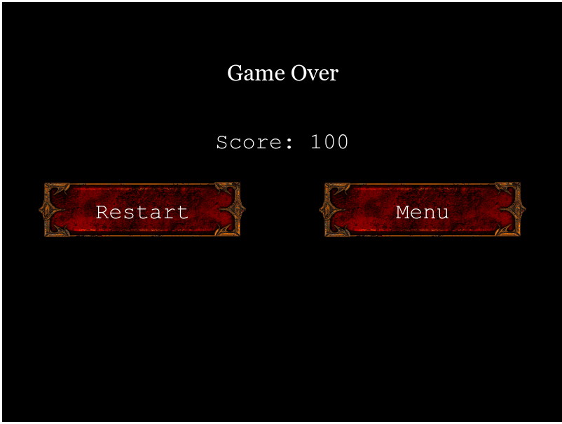

# JavaScript capstone project - RPG game

Building a turn-based RPG game using JavaScript and Phaser game engine

## Table of Contents

- [Objective](#Objective)
- [Story](#Story)
- [Gameplay](#Gameplay)
- [How to Play](#How-to-Play)
- [Technologies Used](#Technologies-Used)
- [Live Version](#Live-version)
- [Install and Run](#How-to-Install-and-Run-in-Your-Computer)
- [Acknowledgments](#Acknowledgments)

### Objective

The objective of this project is to build a simple turn-based RPG game with a scoring system, using JavaScript ES6, Phaser 3 framework, and other modern technologies.

[Up](#Table-of-Contents)

### Story

A Hero goes in search for treasures in a dangerous land where people are known to never return from. The land is filled will trolls and treasures. Can this Hero make it through?

[Up](#Table-of-Contents)

### Gameplay

You control a the Hero character using the up, down, left and right navogation keys. 

You will get by atroll for every traseure box you open.

When attacked you enter the battle screen where you can attack your enemy by pressing the left arrow key twice. This is a turn-based RPG so each of you attack only once per turn. The battle continues until you defeat all foes or be defeated by them. Health it is been restored to full after each battle.

[Up](#Table-of-Contents)

### How to Play

1. #### Start Screen

Enter your name or avatar on the first screen and click on 'Play Now' button.

Next screen is where you control the game. You have 4 options:

2. #### Play

Here is where the fun begins. By clicking 'Play' you are transferred to the forest. You move your character on the screen by using the four arrow keys. You can move up, down, left, right, and even diagonally if you keep to arrows pressed simultaneously.

- #### Battlefield

When attacked by foes you are transferred to the Battlefield. On the left side of the screen appear the attacking enemies. On the right side is your hero. The left area lists the names of the enemies, the right area your hero, and in the middle is the attack command.

The attacker's name is in yellow letters. By pressing left key you can select the troll enemy then press space/left to commence the attack.

If you kill the enemy you return to the forest and you can proceed with your quest. If you lose it is 'Game Over' and you are transferred to the 'Game Over' scene.

3. #### Options

'Music Enabled' checkbox controls whether you will have music during playing or not.

'Sound Enabled' button is not operational yet.

4. #### Credits

The credits for this game.

5. #### LeaderBoard

The top 5 best scores are listed on the LeaderBoard.

6. #### Game Over

[Up](#Table-of-Contents)

### Technologies Used

- Node, npm
- Phaser 3
- JavaScript
- Webpack
- Babel
- Jest
- ESlint
- HTML/CSS
- Netlify
- Microverse Leaderboard API

[Up](#Table-of-Contents)

### Live version

The game is hosted on two different servers, macexperts.gr and netlify.com. Both use the same API to store the scores so it does not matter in which one you play. You can play the game here: 
- [**Live Version**](https://pensive-jepsen-64351b.netlify.app/)

### How to Install and Run in Your Computer

To run the scripts **npm** is required. To get npm you have to install [Node.js](https://nodejs.org). Follow the installation instructions for your system Mac, Linux or Windows.

Use your terminal and run the commands after each instruction.

| Command                                                   | Description                                           |
| ----------------------------------------------------------| ----------------------------------------------------- |
| `git clone https://github.com/OlawaleJoseph/RPG-GAME.git` | Clone the repository to you computer                  |
| `cd RPG-game`                                             | Navigate to the newly created folder                  |
| `npm install`                                             | Install dependencies and launch browser with examples |
| `npm start`                                               | Makes the build and starts the development server     |
|                                                           | Press `Ctrl + c` to kill **http-server** process      |
| `http://localhost:8000`                                   | Visit this link to play the game                      |

[Up](#Table-of-Contents)

## Acknowledgements

- Microverse
- Opengameart.org
- Chest Image by RooMan93
- Button Image by StumpyStrust
- Hero Sprite by Curt

[Up](#Table-of-Contents)

👤 **Adedeko Olawale**

- Github: [@OlawaleJoseph](https://github.com/OlawaleJoseph)
- Twitter: [@javanode123](https://twitter.com/javanode123)
- Linkedin: [olawale-adedeko](http://www.linkedin.com/in/olawale-adedeko)

## 🤝 Contributing

Contributions, issues and feature requests are welcome!

Feel free to check the [issues page](https://github.com/macnick/RPG-game/issues).

1. Fork it (https://github.com/macnick/RPG-game/fork)
2. Create your feature branch (git checkout -b my-new-feature)
3. Commit your changes (git commit -am 'Add some feature')
4. Push to the branch (git push origin my-new-feature)
5. Create a new Pull Request

## Show your support

Give a ⭐️ if you enjoyed this project!

## 📝 License

This project is [MIT](lic.url) licensed.
